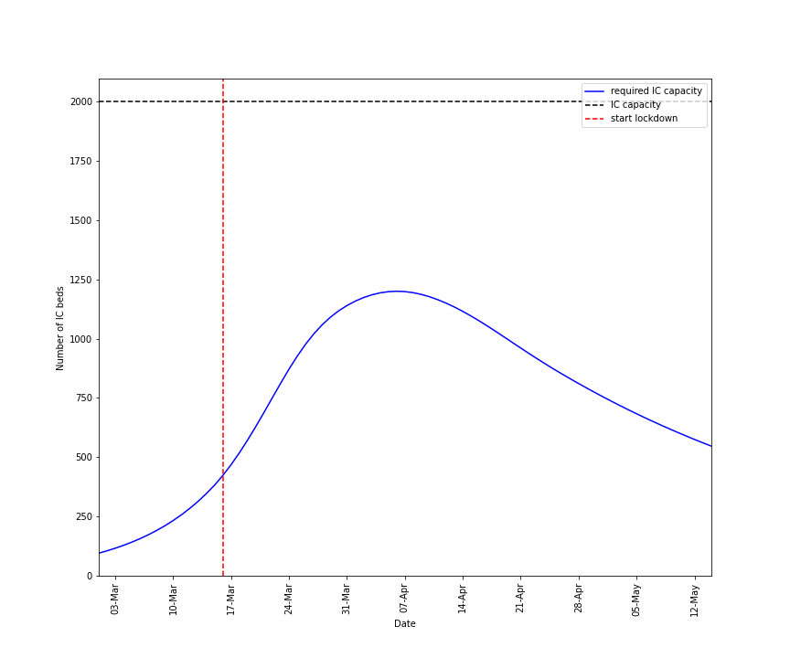
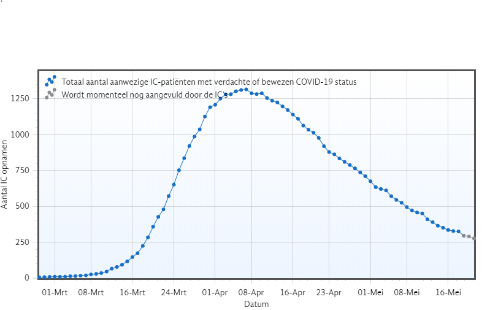
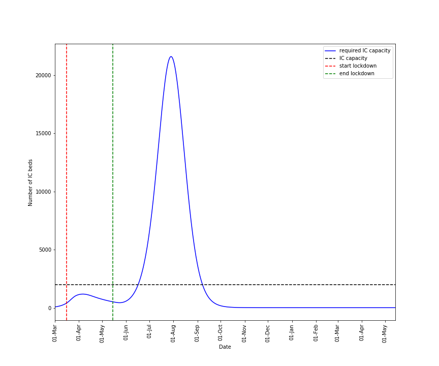
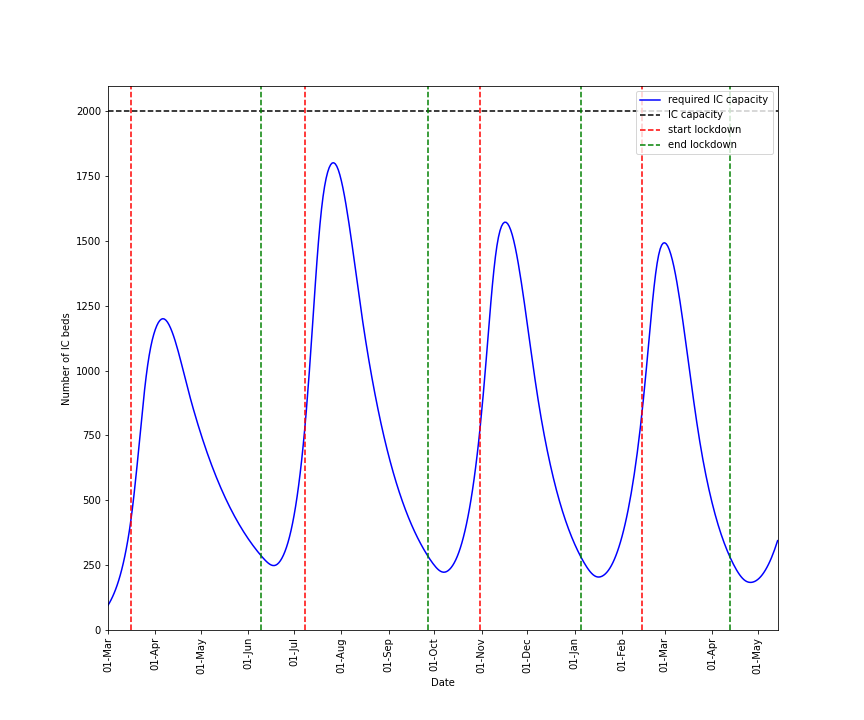
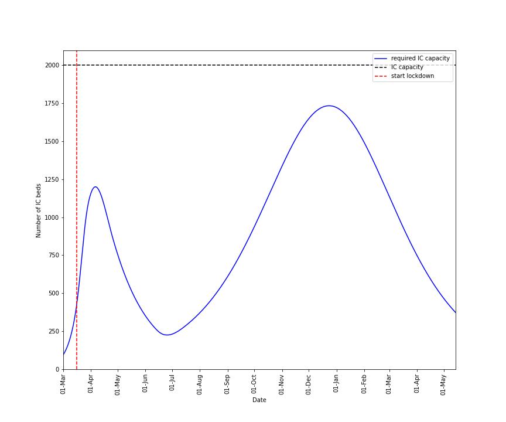
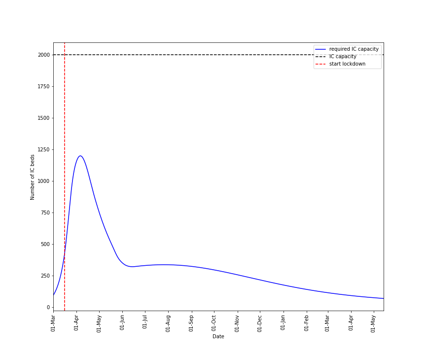

# Modelling the Corona outbreak in the Netherlands 
*12th of May 2020*

At the time I'm writing this, the Coronavirus is impacting the world on a large scale. Countries are shutting down their societies in various degrees in attempts slowdown the spread of the virus and protect their healthcare systems from being overwhelmed. In the Netherlands, the "intelligente lockdown", a series of measurements that enforced a relatively soft lockdown, accomplished to reduce the number of new infections. Hospitals were able to handle the surge of patients requiring treatment. Although the measurements have taken us in the right direction, I was surprised to see how unconcerned people became in the last couple of weeks. The fact is that the virus is still among us.  In this blog I attempt to model the corona outbreak in the Netherlands. Using the model, I will explore how the corona outbreak potentially could develop.  
Before reading on, I want to make a disclaimer, I'm not an expert and the model that I will use is far from perfect and is making a lot of explicit and implicit assumptions that are not correct.  It is meant as a toy model for getting some rough insights in the effects of different policies. 

### Constructing the model 
First, I constructed a model that could be used to simulate the spread of the virus. The Population class represents a certain population at given time. It holds a few methods that update the state (i.e. the number of infected individuals, occupied IC beds etc) over a daily timescale based on de previous state of the population using simple differential equations. It is initialized with a certain state and default arguments that are used by the update methods. I will give some extra explanation on the most important parts of the code. 


#### Explanation on the initialisation parameters and the default argument values

```python
size=17000000
```
The Dutch population size, approximately 17 million.
<br/><br/>

```python
infected=100
```
The amount of infected individuals in the initial state. I used this value just to kickstart the outbreak.
<br/><br/>

```python
si_distribution=norm(7.5, 3.5)
```
Serial interval distribution, it is used to estimate the probability of a certain serial interval. Serial interval is the time between two successive infections. In our case, people are most likely to infect others after 7-8 days. I used a normal distribution based on the results of this [research](https://pubmed.ncbi.nlm.nih.gov/32097725/) that studied the outbreak on the Diamond Princess cruise ship
<br/><br/>

```python
ic_distribution=norm(10, 3.5)
```
Is used to estimate the probability that an infected individual needs to be admitted to the IC x days after becoming infected. I could not find any numbers, but in the news doctors are telling that patients are having mild symptoms for more than a week before their condition becomes severe.
<br/><br/>

```python
max_treatment_duration=30
```
The maximum number of days a patient stays on the IC. Data provided by [Stichting Nice](https://www.stichting-nice.nl/) shows most patients are dismissed from the IC within ~32 days. For simplicity i assume that treatment time is uniform, obviously this is not completely correct.
<br/><br/>

```python
ic_p=.005
```
Based on serological sampling by [Sanquin](https://www.sanquin.nl/over-sanquin/nieuws/2020/04/sanquin-ongeveer-3-van-donors-heeft-corona-antistoffen) it is estimated that 3% of the Dutch population have been infected. This translates to approximately 500000 individuals. Up to now, ~3000 infected individuals needed IC treatment [Stichting Nice](https://www.stichting-nice.nl/). 3000/500000=.005
<br/><br/>

```python
r0=2.2
```
The basic reproduction rate (R0) of the virus. As for the serial interval distribution, I used the estimation from the study on the Diamond Princess.
<br/><br/>


#### Explanation on the methods and functions

```python
def day_to_p(dist, day):
    return dist.cdf(day) - dist.cdf(day - 1)
```
The function is used to calculate the probability that a given viral transmission or IC admission occurs on a specific day (day). It is used by the update_infected and update_ic methods. 
<br/><br/>

```python
    @property
    def r_effective(self):
        susceptible = self.susceptible_t[-1]
        return self.r0 * (susceptible / self.size)
```
A property of the ```Population``` class for the effective reproduction rate (R_effective). This is the actual reproduction rate of the virus which is influenced by the number of infected/immune individuals (assuming that individuals only can be infected once).
<br/><br/>

```python
    def update_infected(self):
        nw_infected = 0
        days_back = 15
        for day in range(1, days_back):
            try:

                # the number of new infected on day(s) back
                n_nwinf = self.nw_infected_t[-day]

                # the current reproduction
                re = self.r_effective

                # the probability that a given transmission occurs after day(s)
                si_p = day_to_p(self.si_d, day)

                # add the contribution to nw infected
                nw_infected += re * si_p * n_nwinf
            except IndexError:
                break

        self.nw_infected = nw_infected
        self.infected += nw_infected
```

This method updates the number of infected individuals. The contribution towards new infection from indivudals that got infected x day(s) earlier can be calculated by multiplying the R_effective, the probability that a given transmission occurs x days after getting infected and the number of individuals that got infected x days earlier. Summing all these contributions will give the total number of new infections. The model only takes the contributions of individuals that got infected in the last 15 days into account, this will cover most of the new infections.
The probability that a given transmission occurs after x days is calculated using the serial interval distribution and using the ```day_to_p``` function.
<br/><br/>

```python
    def update_ic(self):

        # remove dismissed patients
        dismissed_ic = 0
        for day in range(self.max_treatment_duration):
            try:
                index = self.max_treatment_duration - day
                n = self.nw_ic_t[-index]
                dismissed_ic += n * (1 / self.max_treatment_duration)

            except IndexError:
                pass

        # add new ic patients
        days_back = 20
        nw_ic = 0

        for day in range(1, days_back):
            try:

                # the number of new infected on days(s) back
                n_nwinf = self.nw_infected_t[-day]

                # the probability that an infected needs ic
                ic_p = self.ic_p

                # the probability that, given that ic treatment is required, it
                # is required after day(s)
                ic_p2 = day_to_p(self.ic_d, day)

                # add the new ic patients that got infected day days back
                nw_ic += n_nwinf * ic_p * ic_p2
            except IndexError:
                break

        # update state
        balance_ic = nw_ic - dismissed_ic
        self.nw_ic = nw_ic
        self.ic = self.ic_t[-1] + balance_ic
```
Updates the number of individuals in need of IC treatment. First a proportion of the currently treated individuals is dismissed from the IC, afterwards the number of individuals that need IC treatment is calculated. Calculations are performed in a similar way as in the update infected method
<br/><br/>

```python
    def record_state(self):
        self.infected_t.append(self.infected)
        self.ic_t.append(self.ic)
        self.susceptible_t.append(self.susceptible)
        self.nw_infected_t.append(self.nw_infected)
        self.nw_ic_t.append(self.nw_ic)
```
Records the population's state by appending the appropriate values to list attributes. This enables the population to evolve over time and to keep track of it's history.
<br/><br/>

```python
    def run(self, days=1):
        for _ in range(days):
            self.update_infected()
            self.update_ic()
            self.record_state()
```
Evolves the population for ```days``` number of days by calling the the appropriate methods succesively

### Modelling the initial outbreak
After I constructed the model, I used it to simulate the initial outbreak of the coronavirus in the Netherlands.
The virus has been introduced by tourists that returned from their ski vacation in Italy. Since it is unclear how many people were actually infected after their return, I synchronized a simulation with the actual dates of the outbreak in the Netherlands based on the number of new admitted IC patients on a certain day. These numbers can be found on [Stichting Nice](https://www.stichting-nice.nl/).
```python
    # initialize population
    p = Population()

    # synchronize based on the number of new ic patients on day 20
    while True:
        p.run()

        if p.nw_ic > 80:  # on 20 march the number of new ic patients was 82

            t0 = -20  # 1th the of march
            t1 = -5  # 15th of march, start of lockdown

            # remove history, keep 1th to 15th of march
            p.infected_t = p.infected_t[t0:t1]
            p.ic_t = p.ic_t[t0:t1]
            p.susceptible_t = p.susceptible_t[t0:t1]
            p.nw_ic_t = p.nw_ic_t[t0:t1]
            p.nw_infected_t = p.nw_infected_t[t0:t1]

            t0_date = date(2020, 3, 1)
            break
```
</br></br>
On the 15th of march the "intiligente lockdown" started. These measurements reduced the reproduction rate of the virus just below 1 according to the RIVM. In the code below, the reproduction rate of the virus in the synchronized population is set to .9 and the simulation is resumed for an additional 60 days to mimic the lockdown. Afterwards, the number of occupied IC beds is plotted over time.
```python
    # 15 march inteligent lockdown started..
    p.r0 = 0.9
    p.lockdowns.append(len(p.ic_t))
    p.run(60)
    plot_ic(p, "initial_outbreak.png", t0_date)
```
</br></br>
Altough it is not a perfect match the main trends of the predicted IC occupation over time resembles the actual data. This supports the idea that the model could be used to predict the main effects of different future policies 



### Exploring future scenario's
The synchronized population can now be used to explore the effects of different policies. I looked at a few possible scenarios and plotted the predicted required IC capacity overtime.

#### Open Up
The first scenario that I simulated was the 'open up'  scenario. In this scenario we turn back to normal life and consequently the R0 will be the same as before the lockdown. We can simulate this scenario by setting back the r0 attribute to 2.2 and run the simulation for some time,

As soon as all measures are lifted, the virus will spread exponentially again. The effects of the limited herd immunity are negligible and after a few weeks time the IC capacity is exceeded.


#### Interrupted braking
The 'interrupted braking' scenario switches from an open society to a society that's in lockdown as soon as the number of IC admission start to increase rapidly. When the pressure on the IC is relieved, the lockdown is lifted and the society is open again. In the simulation, a lockdown is enforced (r0 is set to 0.9) when more than 80 individuals are admitted to the IC on the same day, and the lockdown is lifted (r0 is set to 2.2) when the number of occupied IC beds is less than 300

As for the open up scenario, the number of IC admission start to increase dramatically only after a few weeks. A new lockdown is enforced and the cycle continues. Note that the time in an open society is shorter as the time in lockdown.

#### Titration
In the 'titration' scenario the measures are partially lifted and the virus is allowed to spread in a controlled way. Over time, the population builds up enough herd immunity so that less measures are necessary. To simulate this scenario, the r0 attribute is increased by .4 if the number of occupied IC beds is less than 300 and the R effective is lower than one. This mimics the relaxation of measures. 

A 'titration' scenario might be able to keep the required IC beds within the max IC capacity. Note that in this simulation the first relaxation brings the r0 from .9 to 1.3 and that it takes approximately a year before next relaxation can be introduced.

#### Extensive testing
In the other scenarios the effect of testing and isolating of infected individuals was completely ignored. Lets assume that because of a combination of extensive testing and tracking half of the infected individuals is put in isolation after 3 days and cannot infect others anymore. The scenario assumes that no further measures are imposed so the r0 is set to 2.2.

According to this simulation track and trace is a quite effective way to combat the spread of the virus. In our simulation their is not even a second wave of IC admissions.

#### Conclusion
In this blog I explored how the spread of the coronavirus potentially could develop under different scenarios using a simple toy model. I want to emphasize that the simulations that are made by the model should not be considered as predictions for reality. The reality is way more complex and in my approach I did a lot of guessing. For example, the reproduction rate may vary between communities and it is unlikely that one knows how cancelling a certain measure will influence the reproduction rate.
Nevertheless, I believe that the model does give some insights in how the epidemic could develop. For instance, it shows how effective case isolation can be and that lifting all measures at once is not an option.
